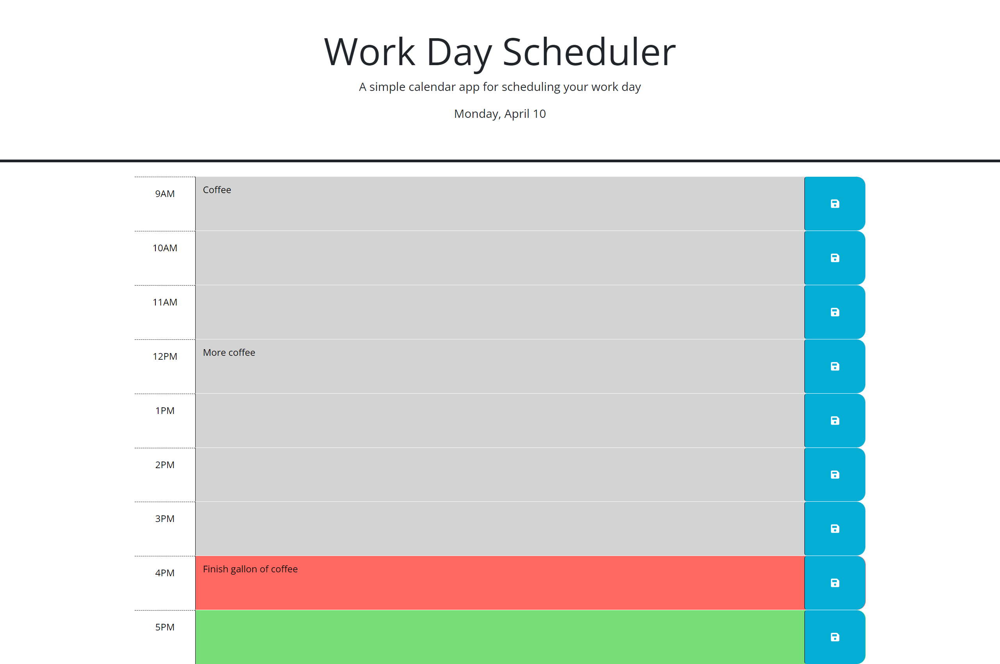

# Work-Day-Scheduler

## Description
This week for our Third-Party APIs Challenge was to create a Work Day Scheduler. In this application I used:
- jQuery library to simplify JavaScript code
- JSON for localStorage
- dayjs library to display date and the proper time for each time block.

The main thing I learned was that third party APIs make writing code more efficent. Also that there is many different ways to write the same code.

## Usage
Click [link](https://n8trask.github.io/Work-Day-Scheduler/) to visit my Work Day Scheduler

